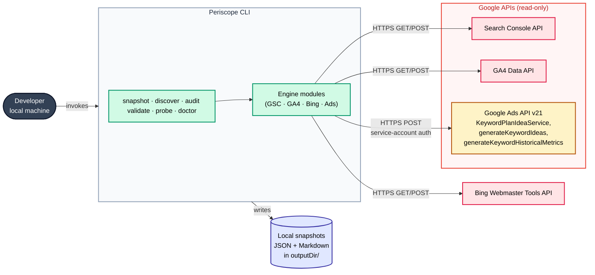

## What it is

**Periscope** is a command-line tool for SEO research across websites and client projects. It unifies data from Google Search Console, Google Analytics 4, Bing Webmaster Tools, and the **Google Ads API (Keyword Planner)** into a single local snapshot, so editorial and landing-page decisions can be made from one source instead of toggling between four dashboards.

## How Periscope uses the Google Ads API

Periscope calls the Google Ads API solely to retrieve **keyword ideas and historical search-volume metrics** from the Keyword Planner. Specifically, it uses the `KeywordPlanIdeaService` and invokes exactly two methods, both read-only.

### POST `generateKeywordIdeas`

**Description:**
Executes seed-based keyword expansion. Returns an adjacent keyword universe suggested by Google Ads based on provided seed keywords, a seed URL, or both.

**HTTP Request:**
`POST /v21/customers/{customerId}:generateKeywordIdeas`

**Required Headers:**

- `Authorization`: `Bearer <service-account-access-token>`
- `developer-token`: `<google-ads-developer-token>`
- `Content-Type`: `application/json`

**Request Body (JSON):**
Provide exactly one of the following seed configurations:

```json
{
  "keywordSeed": {
    "keywords": ["<string>"]
  },
  "urlSeed": {
    "url": "https://<string>"
  },
  "keywordAndUrlSeed": {
    "keywords": ["<string>"],
    "url": "https://<string>"
  }
}
```

### POST `generateKeywordHistoricalMetrics`

**Description**
Retrieves historical performance data—including average monthly search volume, competition tier, and CPC bid ranges—for a specified array of keywords.

**HTTP Request**
`POST /v21/customers/{customerId}:generateKeywordHistoricalMetrics`

**Headers**

- `Authorization`: `Bearer <service-account-access-token>`
- `developer-token`: `<google-ads-developer-token>`
- `Content-Type`: `application/json`

**Path Parameters**

- `customerId` _(string)_: The unique identifier for the target customer account.

**Request Payload**

```json
{
  "keywords": ["term one", "term two"]
}
```

**Output**

<Callout type="info">
  **Read-only by design.** No other Google Ads API service is called. Periscope
  does not create, read, update, or delete campaigns, ad groups, ads, budgets,
  conversions, audiences, or billing data. It performs zero mutations of any
  kind on the Google Ads account.
</Callout>

## CLI commands that consume the Ads API

| Command                     | Use of Ads API                                                              |
| --------------------------- | --------------------------------------------------------------------------- |
| `periscope snapshot`        | Pulls Keyword Planner volume + competition for the configured keyword set   |
| `periscope discover topics` | Seeds Keyword Planner with category names + top GSC queries to surface gaps |
| `periscope audit articles`  | Compares MDX article keywords against Keyword Planner metrics               |
| `periscope validate lps`    | Validates `/lp/*` landing pages against Keyword Planner demand              |
| `periscope probe <url>`     | One-shot URL-seeded keyword ideas for a competitor URL                      |
| `periscope doctor ads`      | Diagnostic that verifies credentials and API reachability                   |

## Authentication

Periscope authenticates to the Google Ads API using a Google Cloud **service account** with a developer token. Credentials are read from environment variables on the developer's local machine:

- `GOOGLE_ADS_DEVELOPER_TOKEN`
- `GOOGLE_ADS_LOGIN_CUSTOMER_ID` (Manager account)
- `GOOGLE_ADS_CUSTOMER_ID`
- `GSC_SERVICE_ACCOUNT_KEY_PATH` or `GSC_SERVICE_ACCOUNT_JSON` (reused for GSC, GA4, and Ads)

**No OAuth user consent flow is involved.** No end-user credentials are collected, stored, or proxied.

## Data handling

- **Scope:** Read-only access to Keyword Planner data for the developer's own Manager-account-linked accounts.
- **Storage:** Responses are written to a local `outputDir` on the developer's machine as JSON and Markdown snapshots. Nothing is uploaded to any third-party service.
- **Sharing:** Data is not shared with, sold to, or exposed to any third party. There are no end users.
- **Retention:** Snapshots are retained locally at the developer's discretion and can be deleted at any time.
- **Compliance:** Use complies with the Google Ads API Terms of Service, including the Required Minimum Functionality requirements for tools that surface Keyword Planner data.

## Call volume

Call volume is **low** — on the order of dozens to low hundreds of requests per day, invoked manually from the CLI during editorial reviews. There is no automated continuous polling.

## Architecture



### Language and build

TypeScript in strict mode. Compiled to ESM via tsup with typed snapshot JSON contracts. Targets Node 22+; the published artifact is the `dist/` directory plus the README.

### CLI

Built on commander, with nested subcommands and a per-command `--help` that includes copy-pasteable examples. The entry point is a single `bin/periscope` that resolves to a small bundled script.

### Engine modules

One file per upstream API under `src/engines/`:

- `gsc.ts` — Google Search Console
- `ga4.ts` — Google Analytics 4
- `bing.ts` — Bing Webmaster Tools
- `ads.ts` — Google Ads Keyword Planner

Each engine takes its config explicitly (site URL, property id, API key, bot regions) rather than reading env vars itself. The orchestrator command reads env vars and a `periscope.config.mjs` from the consumer repo and threads them through. That's what makes the same package usable across any number of consumer projects, each with its own config.

### Shared library

`src/lib/*` holds the cross-cutting pieces:

- Service-account JWT auth (shared across the Google engines)
- Bucket math for keyword volume tiers
- Snapshot markdown renderer
- Config loader (zod-validated)
- ANSI color helpers
- Snapshot store (load / write / list)
- Natural-language date resolver (for the `diff` command)

### Tests

56 unit tests on vitest covering bucket math, config schema, frontmatter parser, color helpers, diagnostics, and snapshot ref resolution. No live API in tests — engines are mocked at the HTTP boundary.

### Distribution

Private npm package `@anthonycoffey/periscope` on GitHub Packages, published via a tag-triggered GitHub Actions workflow. Tags follow `v*` (semver from 1.0.0); consumers pin with `^1.0.0` and pick up minors with `npm update`.

## Command surface

| Command                                             | Description                                           |
| --------------------------------------------------- | ----------------------------------------------------- |
| `periscope snapshot --window=180 --asof=YYYY-MM-DD` | Pull a multi-engine snapshot using defaults.          |
| `periscope diff yesterday`                          | Diff the latest snapshot against yesterday's          |
| `periscope diff 7d`                                 | Diff the latest snapshot against ~7 days ago.         |
| `periscope diff "last month"`                       | Diff the latest snapshot against ~30 days ago.        |
| `periscope diff 2026-05-10 2026-05-17`              | Diff two explicit snapshot dates.                     |
| `periscope discover topics`                         | Surface editorial topic backlog from Ads + GSC.       |
| `periscope audit articles`                          | Flag existing articles whose keyword fit has drifted. |
| `periscope validate lps`                            | Audit landing pages against target keywords.          |
| `periscope probe <url>`                             | Competitor URL probe via Ads Keyword Planner.         |
| `periscope doctor ads`                              | Diagnose Google Ads API credentials and access.       |

## What's next

- An optional Ahrefs engine as a fifth data source
- Additional `doctor` modules for GSC and GA4 access checks

## Source Code

- [github.com/anthonycoffey/periscope](https://github.com/anthonycoffey/periscope)
