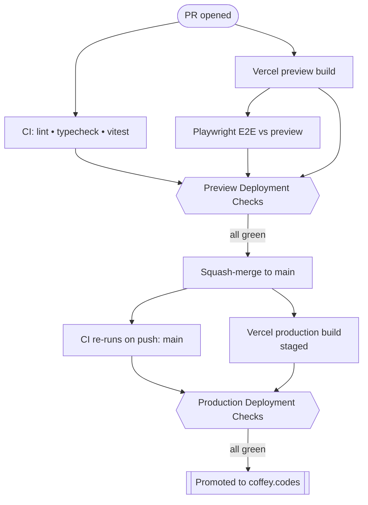

We've all been there. You get a PR approved, the local tests pass, you hit merge, and go grab a coffee. By the time you get back, Slack is blowing up. The production build failed, or worse, it deployed successfully but the app is fundamentally broken for users.

I recently decided to harden my deployment pipeline for this site, which is built with Next.js / TypeScript. The goal was simple: no broken builds hitting production, and a faster, more meaningful CI/CD process that actually validates the code.

What started as a standard GitHub Actions setup evolved into a layered handshake between GitHub and Vercel — using Vercel's Native Deployment Checks where I could, GitHub Actions where I had to, and the Vercel preview deployment as the actual execution environment for end-to-end (E2E) tests. Running E2E against the real preview saved minutes of CI time per PR and made the tests infinitely more trustworthy: they hit the same edge runtime, serverless functions, and caching that production uses, not a mocked-up `next dev` server on a CI runner.

This guide is the story of how I built a production-grade CI/CD pipeline, the pitfalls I encountered, and the exact configurations you can use to protect your own production branch.

## CI/CD Pipeline Overview

When a PR is opened, we run a series of checks before allowing it to be merged:



The goal was to enforce strict gates. A PR should not be allowed to merge unless every check is green. This meant linting, unit tests, strict type-checking, and most importantly, running our Playwright E2E tests against a real deployed environment, rather than a mocked-up `next dev` server on a CI runner.

## Step 1: The First Line of Defense (The PR Workflow)

The foundation of our pipeline is the `test.yml` workflow triggered on pull requests. It handles the fast, immediate feedback loop: ESLint, Vitest (unit tests), and TypeScript compilation.

A brief note on true type safety: _Don't cheat your pipeline._ Using `as any`, `as never`, or `@ts-ignore` inside tests completely defeats the purpose of the `typecheck` step. Build beautifully typed architectures—like using correctly typed `vi.fn<() => Type>()` mocks—so your pipeline is actually protecting you.

Here is what those jobs look like. Notice we enforce a clean run of `tsc --noEmit` so no implicit anys slip through.

```yaml
name: Test
on:
  pull_request:
    branches: [main]

jobs:
  lint:
    # ... setup node & install deps
    - run: npm run lint
  unit:
    # ... setup node & install deps
    - run: npm test
  typecheck:
    # ... setup node & install deps
    - run: npm run typecheck
```

## Step 2: The "Aha!" Moment with Vercel Previews

Previously, I would build the Next.js app on the GitHub runner, spin it up locally, and run Playwright against that local instance. It was painfully slow, but more importantly, it was fundamentally flawed! It didn't test the actual edge network, serverless functions, or the caching layer that production uses.

I thought to myself, "Wait a minute... If Vercel is already building a Preview Deployment for every PR... Why build it twice?" 🤔

So I decided to leverage Vercel's Preview Deployments as the environment for our E2E tests, and this approach provides more confidence that the code is production-ready since our tests run against the actual deployment.

By moving my E2E tests to run against the Vercel Preview, I cut out the build step entirely. This saved ~2–3 minutes per PR _and_ made the test runs more trustworthy because it was hitting a real edge runtime.

To enforce this, I went into GitHub's Branch Protection Rules and required deployments to succeed, specifically checking the `Preview` environment.

<Callout>

Only `Preview` worked, and that's a feature, not a bug. GitHub Branch Protection's "Require deployments to succeed" dropdown lists several Vercel environment names (Production, Preview, etc.). In practice, `Preview` is the one you want.

</Callout>

The other names never turn green in a PR context because PRs don't trigger production deploys. Selecting only `Preview` aligned perfectly with our strategy to test the artifact Vercel is about to serve.

## Step 3: Vercel Deployment Checks — Three Flavors

While GitHub verifies that Vercel built the artifact successfully, **Vercel** wants verification of its own — that *your* tests passed against the SHA it's about to ship. That's the role of **Vercel Deployment Checks**.

Vercel matches required deployment checks to GitHub status checks **by name on the SHA being deployed**. There are three different ways those statuses can land on the SHA, and which one you use changes how much plumbing you have to write.

### Flavor 1: Native Deployment Checks (zero plumbing)

Vercel will run lint and typecheck for you, on Vercel's own infrastructure, using the scripts already in your `package.json`. No GitHub Actions needed.

<Callout>
  Native Deployment Checks only run if your `package.json` has a compatible
  script. The supported names are `lint` (for the lint check), and one of
  `typecheck`, `type-check`, or `check-types` (for the typecheck check). If no
  matching script is found, the check is automatically skipped.
</Callout>

If all you want is `npm run lint` and `npm run typecheck` gating your deploys, you can stop here — Vercel handles it natively and the post-merge SHA problem (more on that below) does not apply, because Vercel doesn't depend on your CI to satisfy these.

### Flavor 2: Match a GitHub Actions job name

For anything Vercel doesn't natively run — Vitest, Playwright, custom scripts — you can let GitHub Actions do the work and have Vercel watch for the resulting status check by name.

GitHub Actions automatically posts a status check named after each job's `name:` field on the SHA the workflow ran against. So if your job is named `Vitest`, GitHub auto-posts a status named `Vitest`. Add a Vercel Deployment Check with that exact name and the wiring is done — no `vercel/repository-dispatch` action required.

To wire this up in the Vercel dashboard, paste a recent commit SHA into the deployment-checks "Add" UI and Vercel will let you pick from the status checks that have run on it. That's how you guarantee the names match — pick from the actual list rather than typing one and hoping.

<Callout type="danger">
  **Gotcha Alert #1:** If you rename a GitHub Actions job, the auto-generated
  status check name changes with it. The Vercel Deployment Check will keep
  watching for the old name and stall every deployment until you update it in
  the Vercel dashboard. Renames are silent breakage.
</Callout>

### Flavor 3: Explicitly notify Vercel

If you want a Vercel check whose name *doesn't* match any single GitHub Actions job — for example, one consolidated `Vercel - coffey-codes: Playwright E2E Tests` status that depends on a multi-step job — use the `vercel/repository-dispatch/actions/status` action to post the status manually:

```yaml
- name: Notify Vercel
  if: always()
  uses: vercel/repository-dispatch/actions/status@v1
  with:
    name: 'Vercel - coffey-codes: Playwright E2E Tests'
    state: ${{ steps.playwright.outcome == 'success' && 'success' || 'error' }}
    github_token: ${{ secrets.GITHUB_TOKEN }}
```

<Callout type="danger">
  **Gotcha Alert #2:** GitHub provides `secrets.GITHUB_TOKEN` automatically to
  workflows, but the `vercel/repository-dispatch` action does *not* consume it
  for you. You must explicitly pass it via the `with:` block, or the status
  call silently fails.
</Callout>

<Callout type="danger">
  **Gotcha Alert #3:** Always set `if: always()` on the Notify Vercel step.
  Otherwise a failed test step skips the notify entirely, Vercel never gets a
  result, and the deployment hangs waiting on a status that will never arrive.
</Callout>

### The Silent Production Hang (the lesson I learned the hard way)

This configuration worked beautifully for PRs. CI went green, the preview deployed, I merged, walked away — and came back to find production hanging indefinitely. Vercel has a button to admin-override and deploy anyway, but I wanted to understand why it was hanging in the first place.

The answer: Vercel was waiting for status checks that were never going to arrive.

_Why?_ Vercel Deployment Checks evaluate the commit that's *being deployed*. When a PR is squash-merged, main gets a **brand-new commit SHA** that has never been through CI. Because the CI workflow only triggered on `pull_request`, it didn't fire for the new push to main. No workflow ran, no GitHub Actions status was posted on the merge SHA, and Vercel waited forever.

This only affects Flavors 2 and 3 above. Native Deployment Checks (Flavor 1) keep working because Vercel runs them itself regardless of GitHub.

**The Fix:** add a `push: branches: [main]` trigger so the same workflow re-runs against the merge commit. GitHub auto-posts the named statuses against the merge SHA, and the Notify Vercel step (if you have one) does the same for any custom-named checks.

```yaml
on:
  pull_request:
    branches: [main]
  push:
    branches: [main]
```

That's the entire fix — no `client_payload` plumbing, no per-event branching in your `checkout` step.

<Callout>
  An alternative is listening to `repository_dispatch` events with type
  `vercel.deployment.success` (Vercel emits these via its GitHub app) and
  checking out `${{ github.event.client_payload.git.sha }}`. It works, and it
  has the bonus of giving you the deployment URL via
  `github.event.client_payload.url`. The `push` trigger above is the path of
  least resistance for plain CI; the `repository_dispatch` route is more useful
  when the workflow needs the deployment URL (for example, post-merge E2E
  tests).
</Callout>

## Step 4: Playwright vs. The Vercel Protection Wall

I created a separate workflow file, `e2e.yml`, to run Playwright. Why separate it? Keeping lint, unit, and typecheck on `pull_request` means they run instantly. The E2E job waits for Vercel to finish building, which takes a few minutes. Splitting them keeps fast feedback fast.

This workflow triggers on `deployment_status`, waiting for Vercel to announce a preview is live:

```yaml
name: E2E Tests
on:
  deployment_status:

jobs:
  e2e:
    name: Playwright
    if: github.event.deployment_status.state == 'success'
    runs-on: ubuntu-latest
    steps:
      - uses: actions/checkout@v4
        with:
          ref: ${{ github.event.deployment.sha }}
```

<Callout>
  I check out `github.event.deployment.sha` to ensure Playwright tests match
  the exact code that was deployed, not just the branch head.
</Callout>

<Callout>
  Vercel also exposes a more direct trigger via `repository_dispatch` events
  fired from its GitHub app. The same workflow could listen for
  `vercel.deployment.success` and grab both the SHA and the deployment URL
  from `client_payload`:

  ```yaml
  on:
    repository_dispatch:
      types: ['vercel.deployment.success']

  jobs:
    e2e:
      runs-on: ubuntu-latest
      steps:
        - uses: actions/checkout@v4
          with:
            ref: ${{ github.event.client_payload.git.sha }}
        - run: npm ci && npx playwright install --with-deps
        - run: npx playwright test
          env:
            BASE_URL: ${{ github.event.client_payload.url }}
  ```

  Both patterns work. `deployment_status` is more idiomatic GitHub-Actions;
  `repository_dispatch` is the path Vercel's docs recommend and is handy when
  you also want the deployment URL handed to you directly.
</Callout>

### Don't run E2E against the live custom domain post-merge

It's tempting to also run E2E after merge to validate production. Don't do it the obvious way.

When a Production deployment is gated on Vercel Deployment Checks, Vercel **stages** the new build — it's deployed to a unique `*.vercel.app` URL but is not promoted to your custom domain (e.g. `coffey.codes`) until the checks pass. If your post-merge E2E job hits the custom domain, it's testing the **previous** production deployment, not the merge being validated. Any new feature in the merge will appear missing, the test fails, the check fails, the deployment is never promoted, and the domain is now permanently stuck on old code. Classic deadlock.

If you really need post-merge E2E, point Playwright at the staged deployment URL (via the Vercel API or `repository_dispatch` event payload), not the custom domain. Or — simpler — drop E2E from your **Production** required deployment checks entirely. The same source already passed E2E on its preview deployment; re-running it post-merge mostly buys you a deadlock.

### The Vercel Protection Bypass

By default, Vercel Preview deployments are password-gated. If Playwright tries to visit the preview URL, it will just test Vercel's login screen.

To fix this, I created a `Protection Bypass for Automation` token in Vercel (Settings → Deployment Protection), stored it as a GitHub secret (`VERCEL_AUTOMATION_BYPASS_SECRET`), and passed it to Playwright as an environment variable, along with the live target URL.

```yaml
- name: Run E2E tests against preview
  run: npx playwright test --project=chromium
  env:
    CI: true
    PLAYWRIGHT_BASE_URL: ${{ github.event.deployment_status.target_url }}
    VERCEL_AUTOMATION_BYPASS_SECRET: ${{ secrets.VERCEL_AUTOMATION_BYPASS_SECRET }}
```

Inside our `playwright.config.ts`, I made the configuration environment-aware:

```ts
const externalBaseURL = process.env.PLAYWRIGHT_BASE_URL;
const bypassSecret = process.env.VERCEL_AUTOMATION_BYPASS_SECRET;

export default defineConfig({
  use: {
    baseURL: externalBaseURL ?? 'http://127.0.0.1:3000',
    extraHTTPHeaders: bypassSecret
      ? { 'x-vercel-protection-bypass': bypassSecret }
      : undefined,
  },
  // Skip spinning up the local server if we are hitting Vercel
  webServer: externalBaseURL
    ? undefined
    : {
        /* local dev server */
      },
});
```

## Step 5: Hardening the Rules

With all workflows in place, the final step was locking down the repository via GitHub's Branch Protection Rules.

A PR cannot be merged unless the following are completely green:

1. Required status checks:
   - `CI / ESLint`
   - `CI / Vitest`
   - `CI / TypeScript`
   - `E2E Tests / Playwright`
2. Require deployments to succeed:
   - `Preview`

On the Vercel side, Production-only required Deployment Checks are kept lean:

- Native lint check (auto)
- Native typecheck check (auto)
- `Vitest` (matches the GitHub Actions job name)

Note what's *not* required on Production: the Playwright E2E check. Preview already validated the same source content, and re-running E2E against staged production hits the deadlock described above. Better to trust the preview gate and keep production promotion fast and predictable.

## Lessons & Gotchas

A condensed list of everything that bit me — useful as a checklist when you're wiring this up on a new project.

### How Vercel Deployment Checks actually work

- Vercel matches required deployment checks to GitHub status checks **by name on the SHA being deployed**. Not by workflow, not by job ID — pure string match.
- **Native** checks (`lint`, `typecheck`) run on Vercel's infrastructure using your `package.json` scripts. No GitHub Actions involvement, no SHA gotcha.
- **Auto-named** GitHub Actions statuses use the job's `name:` field. As long as the Vercel check name matches, no `vercel/repository-dispatch` step is needed.
- **Custom-named** statuses (e.g. `Vercel - coffey-codes: Playwright E2E Tests`) require the `vercel/repository-dispatch/actions/status` action to post the status explicitly.
- When adding a deployment check in the Vercel UI, paste a recent commit SHA and pick from the actual list of statuses that ran on it. Don't type a name from memory — typos are silent breakage.

### The post-merge SHA

- Squash- or merge-commits create a **brand-new SHA** that has never been through CI.
- If your CI only triggers on `pull_request`, no statuses exist on the new SHA, and Vercel waits forever.
- Fix: `push: branches: [main]` on the CI workflow.

### Production E2E is a deadlock trap

- A Production deployment gated on E2E is **staged** (deployed to a unique `*.vercel.app` URL, not yet promoted to your custom domain) until checks pass.
- If your post-merge E2E hits the custom domain, it's testing the *previous* production. Tests fail on any new content, the check never goes green, the deployment never promotes, the domain is stuck on old code forever.
- Workable answers:
  1. **Drop E2E from required Production checks.** Preview already validated the same source.
  2. **Point Playwright at the staged URL** via the Vercel API or `repository_dispatch` payload, not the custom domain.
  3. **No-op the post-merge run** and post `success` directly. Honest only because preview already validated.

### Don't trust `deployment_status` event timing

- For previews, `deployment_status: state=success` fires reliably when the preview build finishes.
- For production with deployment-check gating, the `success` state may not fire until *after* checks pass, or in some configurations no GitHub deployment record is created at all until promotion. Don't build production-side automation around the assumption that the event will land at a predictable point in the lifecycle.

### Workflow design rules of thumb

- **Split fast checks from slow ones.** Lint/typecheck/unit on `pull_request` for instant feedback. E2E on `deployment_status` so you don't double-build.
- **Always check out the deployment's SHA** in deployment-triggered jobs (`ref: ${{ github.event.deployment.sha }}`); the branch HEAD may have moved on.
- **Always pass `github_token` explicitly** to `vercel/repository-dispatch/actions/status`. The action does not auto-consume `secrets.GITHUB_TOKEN`.
- **Always set `if: always()` on the Notify Vercel step.** Otherwise a failed test step skips notify and Vercel hangs.
- **Use a `concurrency` group keyed on the deployment SHA** so a re-deploy cancels stale e2e runs against the previous URL.

### Renaming a job is silent breakage

Changing the `name:` of a GitHub Actions job changes the auto-generated status check name. The Vercel Deployment Check keeps watching for the old name and stalls every deployment until you update it in the Vercel dashboard. There is no warning. Treat job-name changes as a coordinated edit across both repos.

## Conclusion

This pipeline eliminates wasted CI time on redundant environments. E2E tests now run efficiently against production-like infrastructure, ensuring confidence in merges with linted, typed, error-free code.

Saving 2–3 minutes per PR cuts costs and boosts efficiency, and strict branch protection — combined with a sane Vercel Deployment Checks setup — mitigates the risk of broken builds reaching users without backing developers into a deadlock.
