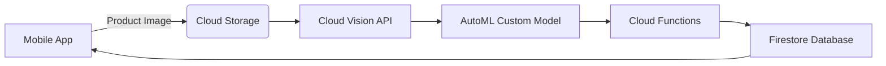
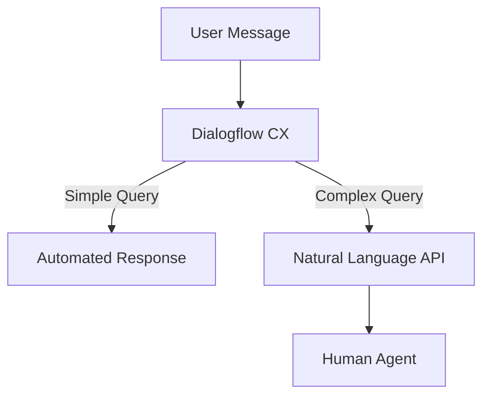

## Introduction: Bridging the AI Implementation Gap

Many businesses struggle to operationalize AI/ML, facing three key challenges:

1. **Complexity** of production deployment
2. **Cost** of incorrect architecture choices
3. **Integration** with existing systems

This guide walks through three real implementations solving these challenges.

---

## Case 1: Inventory Management System

**Problem**: Retail apps experience 20-30% inventory discrepancies due to manual tracking errors.

**Google Cloud Solution**:



**Implementation**:

1. **Image Capture** (React Native example):

```typescript
const captureImage = async () => {
  const image = await ImagePicker.launchCameraAsync();
  const uploadUrl = await uploadToCloudStorage(image.uri);
  await triggerCloudFunction(uploadUrl);
};
```

2. **Cloud Function Processor**:

```typescript
export const processInventoryImage = functions.storage
  .object()
  .onFinalize(async (object) => {
    const visionClient = new VisionClient();
    const [result] = await visionClient.productSearch(object.name);

    await admin
      .firestore()
      .doc('inventory/' + productId)
      .update({ count: result.count });
  });
```

**Key Metrics**:

- Reduced discrepancies to less than 5%
- Processing time: ~1.2s per item

---

## Case 2: Customer Support Automation

**Problem**: 40% of support queries are repetitive, tying up staff.

**Solution Architecture**:



**Implementation Steps**:

1. **Dialogflow Agent Setup**:

```yaml
# dialogflow-cx-agent.yaml
displayName: SupportAgent
defaultLanguageCode: en
timeZone: America/Chicago
```

2. **Sentiment Analysis Integration**:

```typescript
const analyzeSentiment = async (text) => {
  const client = new LanguageServiceClient();
  const [result] = await client.analyzeSentiment({
    document: { content: text, type: 'PLAIN_TEXT' },
  });
  return result.documentSentiment.score;
};
```

**Results**:

- 65% first-contact resolution
- 30% reduction in support staff workload

---

## Case 3: Content Moderation at Scale

**Problem**: Manual review processes don't scale with user growth.

**Technical Implementation**:

1. **Real-time Analysis Pipeline**:

```typescript
const moderateContent = async (content) => {
  const [visionResult, languageResult] = await Promise.all([
    visionClient.safeSearchDetection(content.image),
    languageClient.moderateText(content.text),
  ]);

  return {
    safe: visionResult.safe && languageResult.safe,
    flags: [...visionResult.flags, ...languageResult.flags],
  };
};
```

2. **Threshold Configuration**:

```yaml
# moderation-rules.yaml
image:
  adult: 0.85
  violence: 0.90
text:
  toxicity: 0.80
  identity_attack: 0.75
```

**Outcomes**:

- 95% automated moderation rate
- False positive rate less than 2%


## Getting Started Checklist

1. Enable required Google Cloud APIs
2. Set up service accounts with least privilege
3. Implement gradual rollout strategy
4. Establish monitoring metrics
5. Plan for model retraining cycles

[View sample code repository](https://github.com/anthonycoffey/google-cloud-ai-solutions)
