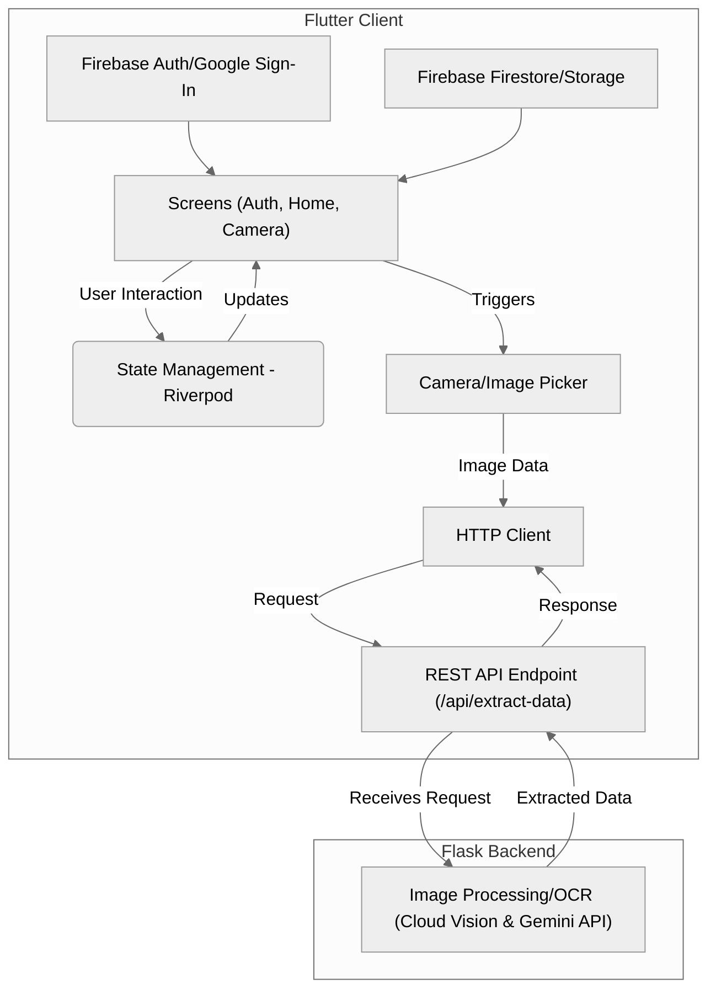

## Introduction: The "Vibe Coding" Experiment

Ever get checkout shock at the grocery store? LabelScan is a mobile app designed to solve that by letting you scan price tags and keep a running total in real-time. But building it was also an experiment: could I "vibe code" an entire app in a language and framework I'd never used before (Flutter/Dart)?

"Vibe coding," in this context, means using AI tools – specifically Cline powered by Google's Gemini 2.5 Pro model – to build applications exclusively through descriptive prompts. The goal wasn't just the app itself, but to test if AI could handle the entire Flutter development process, from UI layout to native features, based solely on my instructions.

This article chronicles that journey, focusing on how LabelScan was built feature-by-feature using AI prompts and the lessons learned about Flutter and AI-assisted development along the way.

> Note: The backend OCR microservice (Python/Flask) was pre-existing and manually repurposed; the focus here is on the AI-driven creation of the Flutter client application.

## The AI-Driven Build Process

Instead of learning Flutter's intricacies upfront, I described the desired features to Cline, letting the AI generate the necessary Dart code and Flutter widget structures.

### Core UI and Initial State

I started by prompting for the basic UI: screens to show the camera feed, a list of scanned items with prices, and the running subtotal, tax, and final cost. Initially, the AI used Flutter's built-in `setState` for managing the app's state (the item list, totals). As complexity grew, I described the need for a more robust solution, prompting a refactor. The AI suggested and implemented `Riverpod`, a popular Flutter state management library, providing a cleaner way to handle state across different widgets.

### Camera and Image Handling

The core feature required camera access. I prompted for functionality to capture images of price labels. The AI correctly selected and implemented the `camera` package, handling permissions and displaying the camera preview. Later, to add flexibility ("feature creep!"), I prompted for the ability to scan images from the user's gallery. The AI integrated the `image_picker` package to achieve this.

### Networking and Backend Interaction

The Flutter app needed to send captured images to the Python/Flask backend for OCR processing and receive the extracted price. I prompted for networking capabilities to hit the backend's REST API endpoint. The AI utilized Flutter's standard `http` package to send the image data and parse the JSON response containing the price. This client-server split kept the Flutter app focused on UI/UX while the backend handled the OCR.

#### System Architecture

The AI also generated this Mermaid diagram to visualize the flow:

## The "Vibe Coding" Experience & Lessons

Building LabelScan entirely through AI prompts was surprisingly efficient and insightful:

- **High Success Rate:** Almost every feature requested worked correctly on the AI's first attempt. Gemini 2.5 Pro demonstrated a strong understanding of the Flutter ecosystem, selecting appropriate packages (`camera`, `image_picker`, `http`, `flutter_riverpod`, Firebase SDKs) and structuring the code logically based on high-level descriptions.

- **The MIME Type Hurdle:** The only significant technical challenge involved correctly handling the image data's MIME type when uploading to the backend via the `http` request. This required more specific, iterative prompting to resolve. However, once the issue was clearly articulated, the AI quickly provided the correct implementation, highlighting the collaborative nature of AI-assisted development.

- **Developer Experience:** The overall DX was excellent. Flutter's informative logs were crucial for diagnosing the MIME type issue for the AI. The ability to describe features and have the AI generate functional code significantly accelerated the process.

- **Pro Tip (The Hard Restart):** A simple but vital lesson when moving fast: sometimes, hot reload isn't enough. If you encounter baffling bugs, ensure the app running is truly the latest build. Killing the old process (`flutter clean` followed by `flutter run`) often resolved "phantom" issues lingering from previous sessions.

- **Flutter's Suitability:** This AI-driven project reinforced Flutter's strengths. Its declarative UI based on widget composition felt intuitive, and the Dart syntax was straightforward to grasp, even via AI generation. For building an app like LabelScan quickly, especially one needing native features like camera access and simple networking, the development process felt notably smoother and perhaps easier than tackling the same scope with React Native. The resulting app felt native and performed well.

## Conclusion: AI as a Co-Developer

LabelScan successfully transitioned from a simple idea to a functional Flutter app, built entirely through "vibe coding" with AI prompts. This experiment demonstrated the viability of using AI (like Cline/Gemini 2.5 Pro) as a co-developer, even in an unfamiliar technology stack.

The process was efficient, with the AI handling most of the implementation details based on high-level feature descriptions. While minor hurdles like the image upload required specific guidance, the overall collaboration was effective. This project serves as a practical example of how AI can accelerate development and lower the barrier to entry for new frameworks.

If you're curious to see the AI-generated code behind LabelScan, check out the repository: [https://github.com/anthonycoffey/flutter-labelscan](https://github.com/anthonycoffey/flutter-labelscan)
