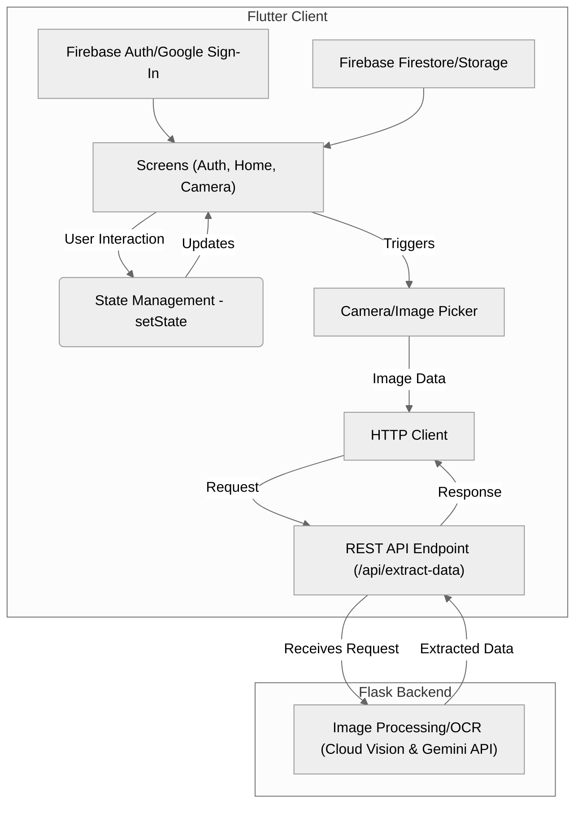

## Introduction

Ever find yourself at the grocery store checkout, bracing for the final tally? Keeping track of your spending _while_ you shop can be a hassle. That's the exact problem I set out to solve with LabelScan, a mobile app designed to scan price tags and maintain a running total of your cart's cost in real-time.

This wasn't a meticulously planned project from the start; I just wanted to see if I could "vibe code" an entire app in a language I was unfamiliar with. If you haven't heard, "vibe coding" is all the rage. It means using AI tools – like Cline powered by Google's Gemini 2.5 Pro model – to build entire applications from start to finish. I had an idea, saw Flutter as an interesting tool, and let the AI drive the development.

Along the way, I learned a _ton_ about Flutter development – the good, the challenging, and the surprising. This article shares that journey, focusing on the practical aspects of building LabelScan and the key Flutter takeaways I gathered while collaborating with AI.

> While the backend OCR microservice was something I had previously built and manually repurposed for this project, the Flutter app was coded entirely with AI.

## Why LabelScan? Why Flutter?

The core motivation was simple: I wanted a way to avoid checkout shock. Manually adding items on a calculator felt clunky, and existing budgeting apps didn't quite fit the real-time, in-store scanning need I envisioned. I needed something fast, visual, and mobile-first.

So, why Flutter? Honestly, it was an experiment driven by AI collaboration. I'd never worked with Flutter or Dart before, and I wanted to see if I could essentially "vibe code" my way through building a functional app in an unfamiliar ecosystem using AI prompts. Could Cline and Gemini 2.5 Pro handle building a complete Flutter app from scratch, feature by feature, based solely on my descriptions? It was a test of both the AI's capabilities and this new development paradigm.

## Building the Frontend: Key Flutter Aspects

Flutter's promise is beautiful, natively compiled applications for mobile, web, and desktop from a single codebase. For LabelScan, the focus was mobile. Here's how some key frontend pieces came together:

### UI & State Management

Flutter's declarative UI paradigm, built around widgets, was central. The main screens involved displaying the camera feed, a list of scanned items with their prices, and the running subtotal, tax, and final cost. Initially, I relied on Flutter's built-in `setState` to manage the app's state – the list of scanned items, the running totals, etc. However, as the app's complexity grew, I found `setState` becoming a bit unwieldy for managing state across different parts of the widget tree.

This led me to refactor and implement `Riverpod`, a popular state management library in the Flutter ecosystem. Riverpod provided a more structured and scalable way to handle dependencies and state, which was a significant learning point in itself.

### Camera Integration

The core feature! The app needed to access the phone's camera to capture images of price labels. I started with the `camera` package, which provides fine-grained control over the device camera. Getting the camera preview working and handling permissions was relatively straightforward thanks to the package's documentation.

Later, as I got more comfortable and started adding features ("feature creep" in the best way!), I also integrated the `image_picker` package. This allowed users to upload profile avatars and even select existing photos from their gallery to scan for prices, adding flexibility beyond the live camera feed.

### Networking

The Flutter app didn't do the heavy lifting of OCR itself. It needed to send the captured image to the Python/Flask backend and receive the extracted price data. For this, I used Flutter's standard `http` package. Since I was connecting to a Flask microservice that I had essentially repurposed for this project, the networking layer was quite direct. Sending the image data as part of the request and parsing the JSON response containing the price was handled effectively by the `http` package without needing more complex libraries like `dio` for this particular use case.

## Connecting to the Brains: Backend & AI Interaction

While Flutter handled the user-facing experience, the intelligence resided in the backend. A Python Flask server acted as the intermediary:

1.  The Flutter app sent the captured image data (from the `camera` or `image_picker`) to a REST API endpoint.
2.  The Flask backend received this image.
3.  The backend then invoked Google Cloud Vision to perform Optical Character Recognition (OCR) on the image and extract price data and infer a product description from the Cloud Vision response using Gemini API.
4.  Once the price was (hopefully) extracted, the backend sent it back to the Flutter app in a JSON response.
5.  The Flutter app received the response, parsed the price using the `http` package, and updated the UI using Riverpod state management to add the item and recalculate the totals.

This client-server separation kept the Flutter app relatively lightweight, focusing on UI and user interaction, while the computationally intensive OCR task was handled server-side.

## Lessons from "Vibe Coding": Flutter Development Takeaways

Diving into Flutter with AI as my co-pilot was certainly an adventure. This "vibe coding" approach, building LabelScan entirely through prompts with Cline and Gemini 2.5 Pro, taught me several things:

- **First-Try Features & The Image Hurdle:** Remarkably, almost every feature requested was implemented correctly by the AI on the very first attempt. The _only_ significant technical hurdle encountered was handling the image upload to the backend. Getting the image data formatted correctly, setting the right MIME types for the HTTP request, and managing the asynchronous flow required a bit more specific guidance. However, once I pointed out the issue clearly, the AI tooling quickly provided the necessary corrections. Outside of that specific challenge, the end-to-end build felt incredibly efficient.

- **Pleasant Surprises (AI Edition):** What stood out positively was not just how "native" the resulting app felt (a testament to Flutter itself), but how effectively the AI navigated the Flutter ecosystem. It chose appropriate packages (`camera`, `image_picker`, `http`, `flutter_riverpod`, Firebase SDKs), structured the code logically, and implemented features based on high-level descriptions. The developer experience (DX), augmented by AI, was exceptional. While Flutter's hot reload is great, the speed at which AI generated entire features often bypassed the need for minor iterative tweaks. Flutter's clear logs remained invaluable, helping pinpoint the image handling issue for the AI to fix.

- **Pro Tip:** A simple but crucial lesson learned, especially when iterating quickly: Make absolutely sure the app running in your simulator or on your device is the _current_ build from your latest `flutter run` command! More than once, I found myself debugging an issue that wasn't actually in my latest code, but persisted from a previous session running in memory. Killing the old process and restarting the simulator, etc. seemed to resolve some of these issues. Hot reloading was working fine most of the time though.

- **Flutter's Suitability:** Based on this project, Flutter feels highly suitable for rapidly building apps that require native device features like camera access and network communication. Its cross-platform nature is a huge plus. While I can imagine potential performance bottlenecks in highly complex scenarios (as with any abstraction layer), the development speed and the quality of the end result were impressive. For cross-platform development, especially for projects like LabelScan, I'd definitely recommend Flutter. My hunch is that the performance overhead might even be more favorable compared to alternatives like React Native, though I didn't benchmark directly.

## Conclusion

Building LabelScan was a practical dive into the world of Flutter, uniquely powered by AI collaboration. Driven by curiosity and the desire to solve a simple, everyday problem, the entire Flutter app was constructed using prompts via the Cline VS Code Extension and Gemini 2.5 Pro. From integrating camera functionality and managing state with Riverpod to connecting with the pre-existing Python backend, the project demonstrated the potential of AI-driven development in mobile app creation.

This "vibe coding" approach, defined here as end-to-end AI-assisted development, proved remarkably effective. The AI successfully navigated the Flutter framework, leveraging its rich widget library and community packages to build a functional application with minimal friction. The primary challenge – image handling – was quickly overcome with targeted feedback, highlighting the iterative nature of AI collaboration. Overall, the journey was overwhelmingly positive, resulting in a useful tool and demonstrating the impressive capabilities of modern AI coding assistants like Cline in tackling a complete project.

If you're curious to see the code behind LabelScan, you can check out the repository on GitHub: [https://github.com/anthonycoffey/flutter-labelscan](https://github.com/anthonycoffey/flutter-labelscan)

#### System Architecture Diagram

The following diagram illustrates the architecture of the LabelScan app, highlighting the interaction between the Flutter client and the Flask backend:

