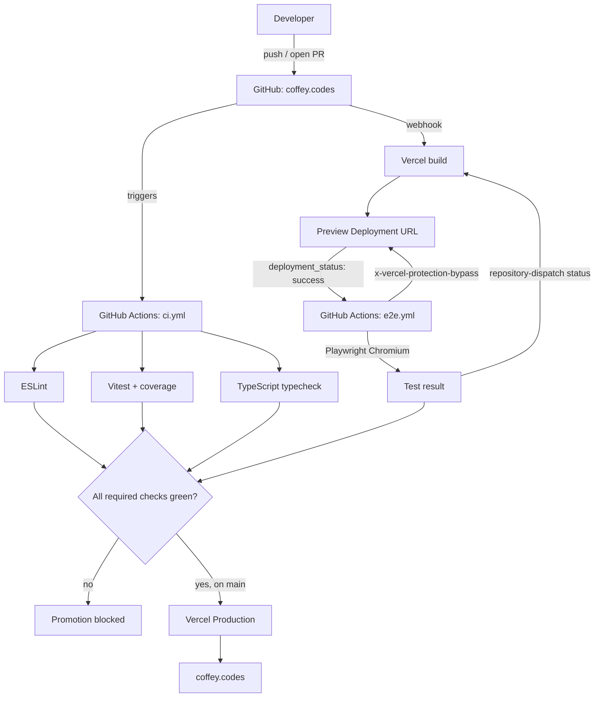

# System Overview

This is the system overview document for coffey.codes. It explains how the major surfaces of the site fit together and how a change moves from a local commit to production. Read this before touching anything non-trivial; the [agent brief](../agents/coffey-codes.md) and [repo technical reference](../repos/coffey-codes.md) go deeper from here.

---

## Core components

### 3D scene home page

The landing page is a scroll-driven cinematic built on React Three Fiber and GSAP ScrollTrigger. [app/page.tsx](app/page.tsx) is intentionally thin — it sets metadata and renders [`<ScrollContainer />`](components/ScrollContainer.tsx), which pins a fixed canvas + overlay and stretches a spacer to `6 × 100dvh` so the scrollbar drives the timeline with `scrub: 1`.

The canvas itself, [components/canvas/WorldCanvas.tsx](components/canvas/WorldCanvas.tsx), opens with a 2000-particle Merkaba (golden tetrahedron) that disperses outward into a 1500-star background field. UFO, Planet, Satellite, Galaxy, and Spaceship objects sit further out, with Bloom + Vignette post-processing tying it together. A `CameraRig` component drives the perspective along the scroll progress.

Copy is layered on top via [components/overlay/HUDOverlay.tsx](components/overlay/HUDOverlay.tsx), which keys four text zones to scroll progress (Intro → About → Craft → Final), with scroll-prompt arrows toggling at the extremes. The canvas is dynamically imported with `ssr: false` because R3F needs the browser.

### Portfolio section

[app/portfolio/page.tsx](app/portfolio/page.tsx) is a single client component that renders four featured projects as tilted polaroid cards in a responsive grid. Project data is held in local state today (no CMS), and clicking a card opens a modal with a gallery and Challenge / Solution / Results sections plus CTAs to the contact page and Calendly. When the project list grows past what's comfortable inline, this is the natural place to factor data out into MDX or JSON.

### MDX blog

Articles are file-based: each post is an `.mdx` file in [app/articles/posts/](app/articles/posts) with YAML frontmatter (`title`, `summary`, `publishedAt`, `tags`, `category`, optional `image`). [app/articles/utils.ts](app/articles/utils.ts) parses frontmatter and exposes the content layer to the rest of the app — `getAllTags`, `getAllCategories`, `getPaginatedBlogPosts`, and the per-slug lookup.

Rendering happens server-side via `next-mdx-remote` in [app/articles/\[slug\]/page.tsx](app/articles/[slug]/page.tsx), with custom MDX components registered in [components/mdx.tsx](components/mdx.tsx) (callouts, syntax-highlighted code via `sugar-high`, etc.). The listing page [app/articles/page.tsx](app/articles/page.tsx) renders a sidebar of tags and categories with counts, and dynamic routes under `/articles/tag/[tag]` and `/articles/category/[category]` provide the filtered views.

Three things hang off the same content layer:

- **Search** — [components/SearchBox.tsx](components/SearchBox.tsx) debounces input and hits `GET /api/search?q=…` ([app/api/search/route.ts](app/api/search/route.ts)), which does a full-text scan over title, summary, content, tags, and category. No prebuilt index — the post set is small enough that runtime filtering wins on simplicity.
- **RSS** — [app/rss/route.ts](app/rss/route.ts) emits an RSS 2.0 feed at `/rss`, sorted by `publishedAt` descending, with XML-escaped fields.
- **Pagination** — `getPaginatedBlogPosts` returns `{ posts, pagination }` and feeds the listing page's `<Pagination>` component.

### Giscus comments

Every article page mounts [components/Comments.tsx](components/Comments.tsx), which embeds Giscus on top of GitHub Discussions in `anthonycoffey/coffey.codes` under the **General** category. Mapping is by `pathname`, so each article gets its own discussion thread, and the Giscus theme is wired to the site's `next-themes` value so it follows system light/dark mode. The upside of this setup: comments are owned in GitHub, moderation happens with familiar tooling, and the site stays a static front-end with no comment database to run.

### Contact page + Google Cloud Function

[app/contact/page.tsx](app/contact/page.tsx) renders a contact panel with phone, email, location, and a Calendly link, alongside [components/ContactForm.tsx](components/ContactForm.tsx) — a Formik + Yup form (name, email, message, consent, all required). On submit it `POST`s to `/functions/sendContactFormEmail` and fires a GA `form_submit` event on success.

The `/functions/*` path is a Next.js rewrite, configured in [next.config.js](next.config.js):

```js
{
  source: '/functions/:path*',
  destination: 'https://us-central1-coffeywebdev-d0487.cloudfunctions.net/:path*',
  basePath: false,
}
```

So the request actually lands on a Google Cloud Function in `us-central1`, which handles email delivery. Keeping the function behind a same-origin rewrite means no CORS surface and no public Cloud Functions URL exposed to the client.

### Enterprise-grade CI/CD

Production is gated by a multi-stage pipeline that has to be fully green before Vercel will promote a deployment. The gate is intentionally strict: lint, types, unit tests, and Playwright e2e against a real preview URL all have to pass.

**Stage 1 — GitHub Actions CI** ([`.github/workflows/ci.yml`](.github/workflows/ci.yml)) runs on every PR and on push to `main`. Three parallel jobs on Node 24:

- **ESLint** — `npm run lint`
- **Vitest** — `npm run test:coverage`, uploads `coverage/lcov.info` as an artifact
- **TypeScript** — `npm run typecheck`

**Stage 2 — Vercel Preview** builds the branch into a unique preview deployment URL.

**Stage 3 — Playwright against preview** ([`.github/workflows/e2e.yml`](.github/workflows/e2e.yml)) is wired to the GitHub `deployment_status` event. When Vercel reports `state == 'success'`, the workflow checks out the deployment SHA, installs Playwright (Chromium), and runs the suite against `github.event.deployment_status.target_url`. Vercel preview protection is bypassed via the `x-vercel-protection-bypass` header (see [playwright.config.ts:18](playwright.config.ts)) using `VERCEL_AUTOMATION_BYPASS_SECRET`. Results are posted back to Vercel via `vercel/repository-dispatch/actions/status@v1` as the named check **"Vercel - coffey-codes: Playwright E2E Tests"**.

**The handshake.** Vercel and GitHub exchange status over the `deployment_status` event and the repository-dispatch status check. Branch protection on `main` plus Vercel's required-checks setting means a deployment can't be promoted to production until every check — lint, typecheck, unit, **and** Playwright against the actual preview build — is green. The result is that what ships is what was tested, against the same artifact a user would hit.

---

## Diagram — CI/CD and hosting



---

## Diagram — Articles subsystem

```mermaid
flowchart LR
    Author[Author] -->|writes .mdx + frontmatter| Posts[app/articles/posts/]

    Posts --> Utils[app/articles/utils.ts<br/>parse frontmatter]

    Utils --> List[app/articles/page.tsx<br/>listing + tags/categories sidebar]
    Utils --> Slug[app/articles/&#91;slug&#93;/page.tsx<br/>renders MDX]
    Utils --> TagRoute[/articles/tag/&#91;tag&#93;/]
    Utils --> CatRoute[/articles/category/&#91;category&#93;/]
    Utils --> SearchAPI[app/api/search/route.ts]
    Utils --> RSS[app/rss/route.ts → /rss]

    Slug -->|next-mdx-remote| MDXReg[components/mdx.tsx<br/>component registry]
    Slug --> Comments[components/Comments.tsx]

    SearchBox[components/SearchBox.tsx] -->|GET /api/search?q=| SearchAPI

    Comments --> Giscus[Giscus widget]
    Giscus --> Discussions[GitHub Discussions<br/>anthonycoffey/coffey.codes · General]

    Reader[Reader] -->|browses| List
    Reader -->|filters| TagRoute
    Reader -->|filters| CatRoute
    Reader -->|reads| Slug
    Reader -->|searches| SearchBox
    Reader -->|subscribes| RSS
```



---

## Related docs

- [Agent brief](../agents/coffey-codes.md) — tech stack, entry points, common tasks, gotchas
- [Repo technical reference](../repos/coffey-codes.md) — architecture decisions and implementation paths
- [Development standards](../development-standards.md) — spec-first workflow and version-control conventions
- [On-page SEO strategy](../deep-dives/onpage-seo-strategy.md)
