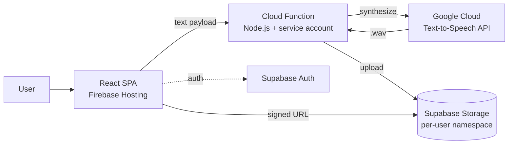

## Reviewer Notes

<!-- Leave empty until code review. -->

---

# Feature: Portfolio media schema standardization + per-item polish

## Problem

The portfolio section has two structural issues that are blocking visual polish:

1. **Media frontmatter is ambiguous.** Items use `mainImage` for both the listing thumbnail (`/portfolio`) and the detail-page hero, even though those two surfaces want different aspect ratios and crops. `gallery` is declared on `PortfolioMetadata` but is never rendered — it's an unused contract. With one image doing two jobs, every item on the index page looks off (wrong crop, wrong density, inconsistent framing), and the detail page has no real media gallery.
2. **`/portfolio/simply-voice` undersells its architecture.** The "Architecture" section is a plaintext ASCII tree inside a fenced code block. Mermaid is already wired up in [components/mdx.tsx:141](components/mdx.tsx:141) via `MermaidChart`, so this is a missed opportunity — a proper diagram would communicate the data flow (React SPA → Cloud Function → GCP TTS / Supabase) far better.

These are independent fixes, but they share the same surface (the portfolio templates), so they ship together.

> **Note from author:** The index-page thumbnails looking off is **not** a styling bug to fix in this spec. It is symptom of the schema problem. Once the new schema is in place, I will redo the assets for each item — the spec's job is to make the templates *consume* the new properties, not to restyle the existing visuals.

## Requirements

### Must have

1. WHEN a portfolio MDX file declares `thumbnail`, `featured`, and `images: [...]` in frontmatter, the system SHALL parse them into typed metadata fields.
2. WHEN the `/portfolio` index renders an item, the system SHALL use `thumbnail` as the card image (falling back gracefully when missing).
3. WHEN the `/portfolio/[slug]` detail page renders an item, the system SHALL use `featured` as the hero/main image and SHALL render a media gallery composed of `[featured, ...images]` (de-duplicated, in declared order).
4. WHEN frontmatter for a portfolio item omits any of the three media fields, the system SHALL still render the page without crashing (graceful fallback per surface — see Design).
5. WHEN `/portfolio/simply-voice` is rendered, the "Architecture" section SHALL display a Mermaid diagram of the request/data flow in place of the current ASCII code block.
6. All five existing portfolio items SHALL have their frontmatter migrated to the new schema in this PR. The new schema SHALL be the only supported shape after merge.

### Nice to have

- A small reusable `<PortfolioGallery />` component (thumbnails strip + lightbox or simple grid) so future items get the same gallery behavior for free.
- Lightweight Mermaid theming tweaks (if needed) so the diagram reads on both light and dark themes — only if the default doesn't already work.

### Non-goals (what this does NOT do)

- This spec does NOT redesign the index card layout, fix card crops, or tune image styling. Visual polish on `/portfolio` is a separate pass after I redo the assets.
- This spec does NOT add Mermaid diagrams to portfolio items other than `simply-voice`. Other items can adopt them later as standalone edits.
- This spec does NOT add image optimization beyond what `next/image` already provides.
- This spec does NOT introduce a backwards-compat shim for the legacy `mainImage` / `gallery` fields — all items migrate in this PR (clean cut).

## Design

### Frontmatter schema (new)

| Field         | Type       | Surface used on                  | Notes                                                               |
| ------------- | ---------- | -------------------------------- | ------------------------------------------------------------------- |
| `thumbnail`   | `string`   | `/portfolio` index card          | Optimized for card aspect (likely landscape, tight crop)            |
| `featured`    | `string`   | `/portfolio/[slug]` hero + first gallery slot | The "main" / hero image                                  |
| `images`      | `string[]` | `/portfolio/[slug]` gallery (after `featured`) | Additional shots; render order = declared order             |

All three are optional individually; templates degrade gracefully if any are missing (see Edge cases).

### Fallback rules

- Index card: if no `thumbnail`, fall back to `featured`, then to the existing icon placeholder.
- Detail hero: if no `featured`, fall back to `thumbnail`, then to the existing `CodeBracketSquareIcon` block.
- Detail gallery: render only when `featured` or at least one `images[]` entry exists. If only `featured` exists, render it as a single-image figure (no thumbnail strip).

### Loader changes (`app/(site)/portfolio/utils.ts`)

- Add `thumbnail`, `featured`, `images` to `PortfolioMetadata`.
- Remove `mainImage` and `gallery` from the type. Parser drops these keys (or warns) — they will not exist in the migrated MDX files.
- The existing frontmatter parser is hand-rolled and already handles array values for `tags` / `gallery`; extend the same `case` branches for `images` and add scalar `thumbnail` / `featured`.

### Template changes

- **`app/(site)/portfolio/page.tsx`** — swap `metadata.mainImage` → `metadata.thumbnail ?? metadata.featured`.
- **`app/(site)/portfolio/[slug]/page.tsx`** — swap the header `Image` source to `featured ?? thumbnail`. Update the OG image / JSON-LD `image` field to prefer `featured`, then `thumbnail`.
- **Gallery rendering** — introduce a small server component (e.g. `components/PortfolioGallery.tsx`) that takes `{ featured, images, title }` and renders a simple grid (no lightbox in v1 unless trivial). Mount it on the detail page below the MDX body, or inside the hero area depending on what reads better — decide during implementation, document in commit.

### Mermaid diagram for `simply-voice`

Replace the ASCII tree with a Mermaid `flowchart` (LR or TB — pick what reads best in the article column width). Suggested shape:



Wire this up with a ` ```mermaid ` fence (already supported by [components/mdx.tsx:141](components/mdx.tsx:141)). Final node labels / arrow text can be refined during implementation.

### Tests

- Update `__tests__/portfolio/page.test.tsx` and `__tests__/portfolio/slug-page.test.tsx` to assert on the new field names.
- Add a unit test covering the loader's parsing of the three new fields (especially the array form of `images`).
- Add an assertion that the simply-voice detail page renders a `<MermaidChart>` instance (or its container) under the Architecture heading.

## Edge cases

- [ ] Item with no `thumbnail` but with `featured` → index card uses `featured`. No layout break.
- [ ] Item with no `featured` but with `thumbnail` → detail hero uses `thumbnail`. JSON-LD `image` set accordingly.
- [ ] Item with `featured` only, empty `images: []` → gallery renders as a single figure (no strip).
- [ ] Item with no media at all → index card shows icon placeholder; detail page shows the existing `CodeBracketSquareIcon` fallback; no gallery section.
- [ ] Mermaid diagram fails to render (e.g. JS disabled) → fenced code falls through to the `MermaidChart` component's existing fallback (whatever that is — verify during implementation; if there is no fallback, the source text should at minimum remain readable).
- [ ] Mermaid theming on light vs dark → verify diagram is legible in both themes (project uses `next-themes` system-only).

## Acceptance criteria

1. All five portfolio MDX files use only the new fields (`thumbnail`, `featured`, `images`); no remaining references to `mainImage` or `gallery` anywhere in `app/`, `components/`, or `__tests__/`.
2. `npm run typecheck`, `npm run lint`, and `npm test` all pass.
3. Visiting `/portfolio` shows each item's `thumbnail` (or the documented fallback chain) — no crashes, no missing-image errors in dev console.
4. Visiting `/portfolio/[slug]` shows `featured` in the hero and a gallery of `[featured, ...images]` below the body (when media exists).
5. Visiting `/portfolio/simply-voice` renders a Mermaid diagram under the "Architecture" heading — verified visually in dev.
6. The detail page's OG image / JSON-LD `image` field resolves to `featured` (or documented fallback) and is a fully-qualified URL.
7. e2e `e2e/portfolio.spec.ts` still passes (update selectors if it asserted on `mainImage`-derived markup).

## Constraints

- Do not break the App Router server-component model — gallery should be a server component unless lightbox interaction requires `'use client'`.
- Mermaid is already a runtime client dependency via `MermaidChart`; do not duplicate.
- Image paths remain under `/public/portfolio/` (no asset reorganization in this spec). I will swap in new asset files in a follow-up commit / PR once the template consumes the new fields.

## Tasks

- [ ] Update `PortfolioMetadata` type and frontmatter parser in `app/(site)/portfolio/utils.ts` (add `thumbnail`, `featured`, `images`; remove `mainImage`, `gallery`).
- [ ] Update `app/(site)/portfolio/page.tsx` to read from `thumbnail` (with documented fallback).
- [ ] Update `app/(site)/portfolio/[slug]/page.tsx` to read from `featured` for hero + JSON-LD; update OG image source.
- [ ] Build `components/PortfolioGallery.tsx` (server component, `[featured, ...images]`).
- [ ] Migrate all 5 MDX files' frontmatter to the new field names (keep current asset paths for now; I'll re-shoot assets after merge).
- [ ] Replace the ASCII architecture block in `app/(site)/portfolio/items/simply-voice.mdx` with a Mermaid flowchart.
- [ ] Update / extend tests in `__tests__/portfolio/` to cover new fields + fallback rules + the Mermaid block.
- [ ] Update `e2e/portfolio.spec.ts` selectors if they reference `mainImage`-derived DOM.
- [ ] Visually verify on `npm run dev` in both light and dark themes before requesting review.

## Notes

- Mermaid support in MDX is already implemented at [components/mdx.tsx:141](components/mdx.tsx:141) — no infra work required.
- The `gallery` field on `PortfolioMetadata` was declared but never rendered (no consumer in `app/` or `components/`). This is a chance to actually ship the gallery surface, not just rename the field.
- After this ships, expect a follow-up commit (no spec needed) where new optimized assets replace the existing ones per-item.
